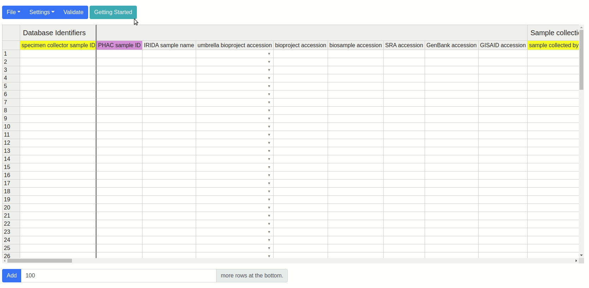
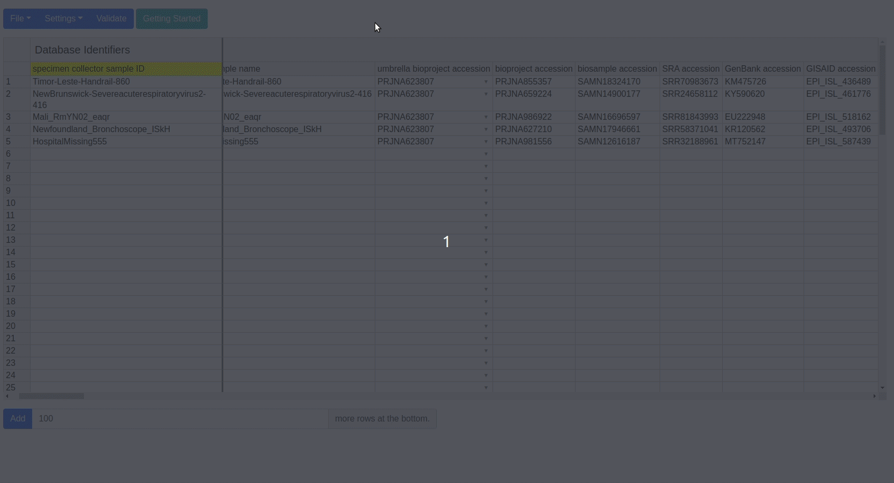
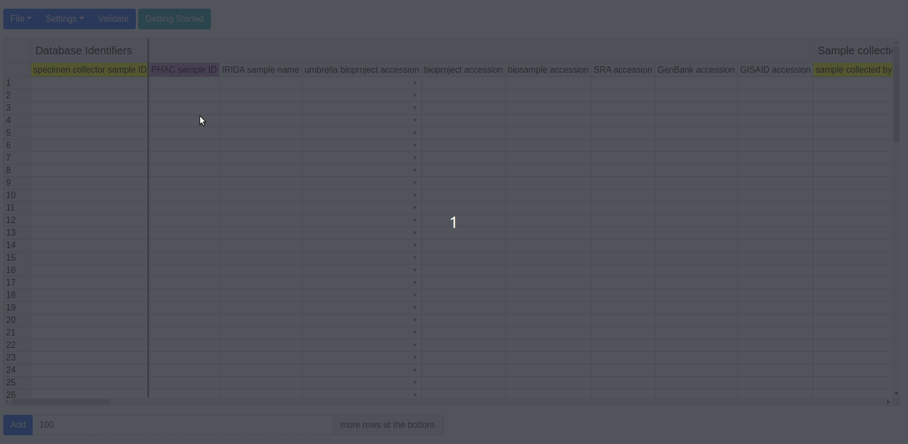

# DataHarmonizer

A standardized spreadsheet editor and validator for SARS-CoV-2 sampling data, 
that can be run offline and locally.

|Chrome|Firefox|Edge|
|---|---|---|
|49+|34+|12+|

## Installation

Download the zipped source code from the latest release at:
https://github.com/Public-Health-Bioinformatics/DataHarmonizer/releases

Extract the zipped file.

To run the application, navigate to the extracted folder and open `main.html`.

## Usage

You can edit the cells manually, or upload `xlsx`, `tsv` and `csv` files. You 
can also save the spreadsheet's contents to your local hard-drive.

Click the validate button to validate your spreadsheet's values against a 
standardized vocabulary.

Double click any column headers for information on the grid's vocabulary.

## Support

If you have any ideas for improving the application, or have encountered any 
problems running the application, [please open an issue for discussion][1]. 

[1]: https://github.com/Public-Health-Bioinformatics/DataHarmonizer/issues

## Roadmap

This project is currently in the pre-alpha phase, and therefore still under 
active development, with new features being added regularly.

## Acknowledgement

[Handsontable](https://handsontable.com/) was used to build the grid. 
[SheetJS](https://sheetjs.com/) was used to open and save local files.

## License

[MIT](LICENSE)
